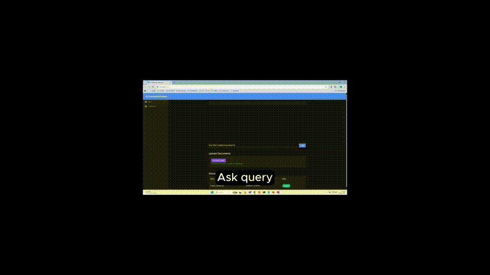
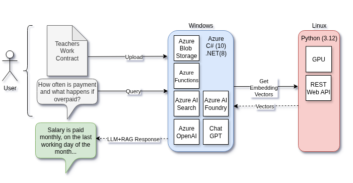
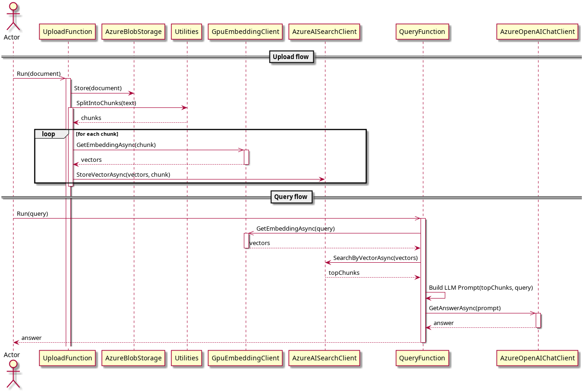

# AzureRag: Document Querying
## C#/.NET, Azure, LLM, Python, CI/CD, E2E Tests
This project allows users to query documents they have uploaded. It includes a lightweight AI component to illustrate real-world integration, with the primary focus on production-grade engineering rather than deep AI development. 

It is a **multi-service, production-oriented RAG (Retrieval-Augmented Generation) system** with scalable C# services and APIs for data ingestion, processing, and LLM (Large Language Model) serving in a cloud environment.  It also demonstrates a **fully automated CI/CD pipeline** with **E2E (End-to-End) tests** using **C#/.NET, Python, Azure, GitHub** and **Postman**. 

## Overview and Example

The user uploads a teachers employmnet contract and then asks specific questions about that contract.

## Why RAG?
LLMs provide general knowledge and cannot reliably answer questions regarding specific private documents, proprietary knowledge or when data frequently changes.  **Retrieval-Augmented Generation (RAG)** solves this by: Retrieving relevant documents via vector search, Injecting them into the prompt, and Generating **grounded, explainable answers**.  This project implements a RAG pipeline pattern end-to-end using Azure services with a local GPU performing vector embeddings to reduce costs.

---
## Sequence Diagram

---
## Design Overview
`AzureRag` is designed with testability, DI (Dependency Injection), and containerized deployment in mind.

Core functions:
- `UploadFunction` — document ingestion, chunking, embedding creation, vector storage.
- `QueryFunction` — query embedding, vector search, prompt composition, LLM answer.

Software Engineering Considerations:
- Clean architecture: interface-driven clients (`IEmbeddingClient`, `IAiSearchClient`, `IBlobStorage`, `IChatCompletionClient`) and a `ClientFactory`.
- Dependency Injection using .NET Generic Host; configuration via `Settings.cs`.
- Testable code: xUnit and pytest tests with fakes/mocks using DI, exercising upload and query pipelines.
- Production-ready concerns: Asynchronous calls for scalability, cancellation tokens, streaming-safe parsing, and multi-stage Dockerfile.
- CI/CD automation with GitHub Actions to run unit tests, build and push Docker container images from GitHub Container Registry (GHCR), deploy to self-hosted GitHub Actions runners, and run end-to-end tests.

---
## Tech Stack

| Area | Technology |
|----|----|
| Languages | C# 12 (.NET 8), Python 3.12 |
| LLM | Azure OpenAI (GPT-5-mini) |
| Storage | Azure Blob Storage |
| Embeddings | `all-mpnet-base-v2` local GPU |
| Vector DB | Azure AI Search |
| Search Algorithm | HNSW |
| Containers | Docker |
| CI/CD | GitHub Actions |
| Cloud | Microsoft Azure |
| Unit Tests | xUnit, pytest |
| E2E (End-to-End) Tests | Newman (Postman) |

---
## Future Improvements
- Add document-level citations to responses
- Web UI
- Extend unit and E2E tests
- Cancellation implementation
- Replace API keys with Managed Identity
- Hybrid search (vector + keyword)
- Observability and telemetry integration
- Fine-tuned LLM
- Azure Function Authorization
---

