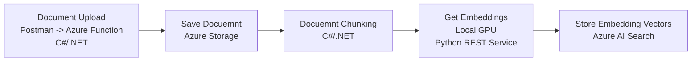
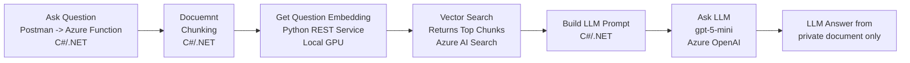

# AzureRag
**Retrieval-Augmented Generation (RAG) using Azure and local GPU**

AzureRag is a **multi-service, production-oriented RAG system** built using **Azure OpenAI**, **Azure AI Search**, **C#/.NET** and **Python**.  
It ingests documents, generates embeddings, performs vector searches, and generates LLM responses specific to the uploaded documents.  With a **fully automated CI/CD pipeline**, this project is intended to demonstrate CI/CD software engineering practices applied to modern LLM systems.

## Why RAG?
LLMs alone cannot reliably answer questions regarding:
- Private documents
- Proprietary knowledge
- Frequently changing data

**Retrieval-Augmented Generation (RAG)** solves this by:
1. Retrieving relevant documents via vector search
2. Injecting them into the prompt
3. Generating **grounded, explainable answers**.

This project implements a RAG pipeline pattern end-to-end using Azure services with a local GPU performing vector embeddings to reduce costs.

---
## Key Features
- Document ingestion and chunking
- Embedding generation with Azure OpenAI
- Vector search using Azure AI Search (HNSW)
- Retrieval-Augmented Generation (RAG) pipeline
- Strongly-typed C# implementation
- Unit + end-to-end testing
- Dockerized services
- End-to-end CI/CD with GitHub Actions

---
## High-Level Flow
### Upload Document

### Query Document

---
## Project Design Overview
`AzureRag` is designed with testability, DI (Dependency Injection), and containerized deployment in mind.

Core functions:
- `UploadFunction` — document ingestion, chunking, embedding creation, vector storage.
- `QueryFunction` — query embedding, vector search, prompt composition, LLM answer.

Software Engineering Considerations:
- Clean architecture: interface-driven clients (`IEmbeddingClient`, `IAiSearchClient`, `IBlobStorage`, `IChatCompletionClient`) and a `ClientFactory`.
- Dependency Injection using .NET Generic Host; configuration via `Settings.cs`.
- Testable code: xUnit tests with fakes (`Tests/Fakes/*`) exercising upload and query pipelines.
- Production-ready concerns: `IHttpClientFactory`, cancellation tokens, streaming-safe parsing, and multi-stage Dockerfile.
- CI/CD automation with GitHub Actions to run unit tests, build and push container images, deploy to self-hosted nodes, and run end-to-end tests.

---
## Tech Stack

| Area | Technology |
|----|----|
| Languages | C# 12 (.NET 8), Python 3.11 |
| LLM | Azure OpenAI (GPT-5-mini) |
| Storage | Azure Blob Storage |
| Embeddings | `all-mpnet-base-v2` local GPU |
| Vector DB | Azure AI Search |
| Search Algorithm | HNSW |
| Containers | Docker |
| CI/CD | GitHub Actions |
| Cloud | Microsoft Azure |
| Unit Tests | xUnit, pytest |
| E2E (End-to-End) Tests | Newman (Postman) |

---
## Unit Testing
Unit tests are executed automatically based on which parts of the repository change. Tests are run before any container build to ensure correctness of inference logic and preprocessing independently of external interfaces and GPU availability.  No deployment occurs unless all relevant unit tests pass.

### AzureFunction (C# / .NET)
- .NET 8
- xUnit

### GpuLocal (Python)
- Python 3.11
- pytest

---
## Build & Push
Each service is built and published independently. This approach allows services to evolve independently while maintaining consistent deployment artifacts.
- Docker images are built for:
  - **AzureFunction**
  - **GpuLocal**
- Images are pushed to **GitHub Container Registry (GHCR)**
- Builds are fully reproducible and versioned

---
## Deployment
Deployments are handled via **self-hosted GitHub Actions runners**:
- `machine-a` → AzureFunction
- `machine-b` → GpuLocal
Deployment behavior:
- Pulls the latest container image
- Stops and removes the previous container
- Runs the new container with exposed ports
- Ensures clean, deterministic deployments per service

---
## End-to-End Testing
After deployment, **end-to-end tests** are executed using **Postman / Newman** to provide confidence that the entire system functions correctly in a deployed environment.
These tests validate:
- Service availability
- Cross-service communication
- End-to-end RAG behavior
- Real request/response flows

---
## Future Improvements
- Add document-level citations to responses
- Web UI
- Extend unit and E2E tests
- Cancellation implementation
- Replace API keys with Managed Identity
- Hybrid search (vector + keyword)
- Observability and telemetry integration

---

